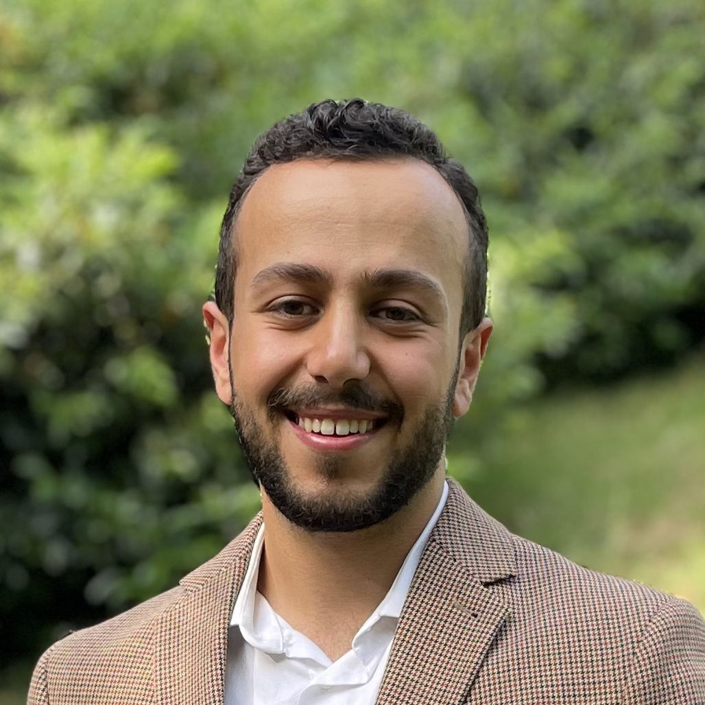

# Oweis Al-Agtash

Software and DevOps Engineer • B.Sc. Computer Engineering • Born 26.06.1994 • Lives in [Frankfurt am Main] • Email: [oalagtash@gmail.com]

[LinkedIn] | [github]

## [TL;DR]⠀

- *DevOps Engineer* - the main responsible engineer for CI/CD ecosystem and the python-invoke library for automated development and delivery workflows.

- *Software Developer* - developed and maintained software on both server-side and client-side mainly with java, following best practise and clean code concepts, using market leading frameworks like Spring, Maven and Camel. In addition, building a library with python and Invoke Library that helps to build and manage 30+ projects.

- *Release Manager* - planned and maintained a stable software delivery from developers hands until production systems by automating and following Continues Integration and Continues Delivery practices.

## About me

WIP...

## Languages

- Arabic – Native
- German – Fluent (TestDaf 18 ~C2 certified)
- English – Fluent

## Hobbies

- Enjoy cycling and restoring vintage bikes
- Learn piano and ukulele
- Enjoy evening reads 
- Stress myself with investing

------
[This document is maintained on github]

[This document is maintained on github]: https://github.com/oalagtash/CV
[TL;DR]: https://en.wikipedia.org/wiki/Wikipedia:Too_long;_didn%27t_read
[Frankfurt am Main]: https://www.google.com/maps/place/Frankfurt+am+Main/@50.1213475,8.4961381,11z/data=!3m1!4b1!4m5!3m4!1s0x47bd096f477096c5:0x422435029b0c600!8m2!3d50.1109221!4d8.6821267
[oalagtash@gmail.com]: mailto:oalagtash@gmail.com
[LinkedIn]: https://www.linkedin.com/in/oweis-al-agtash-b2010b101/
[github]: https://github.com/oalagtash